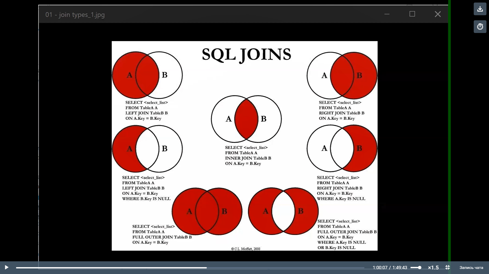

## MySQL

1. Введение в MySQL
2. SQL – создание объектов, простые запросы выборки
3. SQL – выборка данных, сортировка, агрегатные функции
4. SQL – работа с несколькими таблицами
5. SQL – оконные функции
6. SQL – Транзакции. Временные таблицы, управляющие конструкции, циклы

## Круги Эйлера

